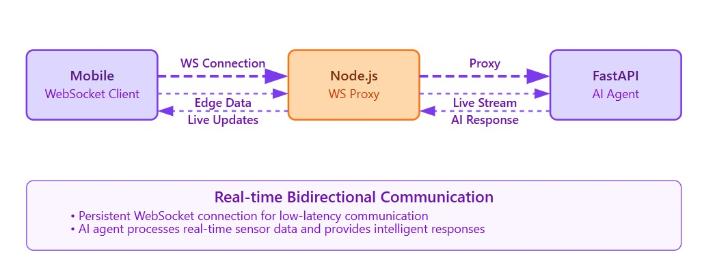
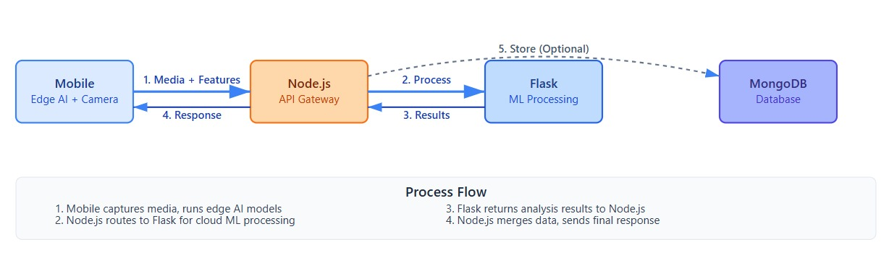
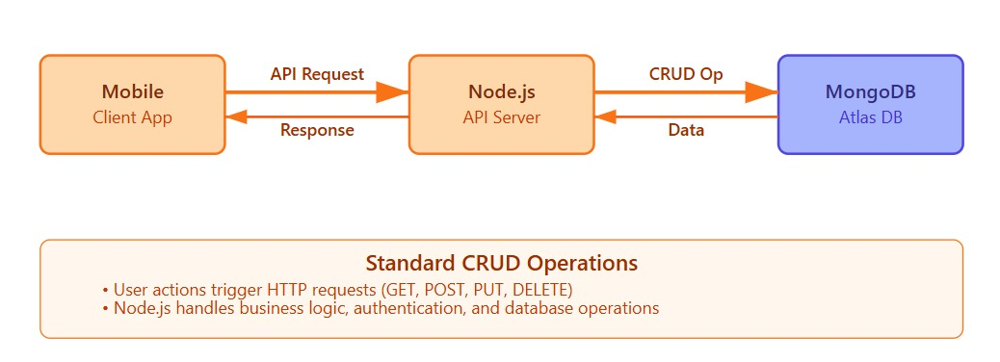

# AI-Powered Mobile Platform for Democratizing Sports Talent Assessment

A lightweight, mobile-first platform that lets athletes on entry-level smartphones record standard fitness tests, performs on-device and server-side AI/ML verification & cheat detection, and securely submits verified results for official evaluation.

---
# Demo Video of the Project
![[Watch the demo of the app and website]](https://youtu.be/h7DEwsRT4p4?si=G91_AOog7z-tsJNi)

## Table of contents
- Project overview
- Architecture
- Key features
- Repository layout
- Quick start (Windows)
  - Aiml (Flask) service
  - Node.js bridge backend
  - React Native mobile frontend
- API reference (important endpoints + examples)
- Development notes & limitations
- Contributing
- License & contact

---

## Project overview
Background: Identifying sporting talent at scale is challenging in large and diverse countries. This platform enables athletes to self-record a set of standard fitness tests (pushups, sit-ups, squats, vertical jump, long jump, etc.), runs AI/ML analysis for counting/metrics and cheat detection, and provides a secure flow to submit verified assessments to officials.

Goal: Democratize talent discovery by making assessment low-cost, mobile-first, offline-capable, and auditable.

---

## High-level architecture
- Mobile frontend (React Native) — record videos, sends videos to backend, optionally run lightweight on-device inference.
- Backend bridge (Node.js) — receives uploads from applications, validates/authenticates, forwards video + reference images to the Aiml Flask service, stores results, send the result to frontend and exposes a dashboard API.
- Aiml service (Python / Flask) — heavy AI modules, pose extraction, rep counting, cheat detection, face verification, per-exercise analyzers and comprehensive multi-session analytics.

Typical flow:
1. User records test in mobile app.
2. App sends video + optional reference images to Node bridge.
3. Node bridge forwards files to Flask Aiml endpoint /analyze_mobile.
4. Aiml performs analysis, returns JSON. Node persists results and forwards to dashboard or SAI ingestion pipeline.
5. Officials can call /comprehensiveAnalysis with exactly assessment files for multi-session benchmarking.
6. Send a report to SAI authority for further evaluation

---

## Key features
- Mobile-optimized video analysis (real-time rep counting, jump height/distance).
- Cheat detection (video tampering, inconsistent motion, rapid frame anomalies).
- Face verification for identity validation.
- Comprehensive multi-session analysis and benchmark scoring.
- Low-bandwidth friendly: option to run preliminary analysis on-device and upload only results.
- Gamified user interface with benchmarking capabilities.

---

## Repository layout (important files)
- Aiml/
  - mobile_integration_system.py — Flask app + integration & endpoints.
  - mobile_sports_assessment_engine.py — pose extraction, rep counting, jump analysis.
  - mobile_cheat_detection_engine.py — cheat detection & face verification utilities.
  - comprehensive_analysis_engine.py — cross-session scoring and benchmarking helpers.
  - v3comprehensive_analysis.py — legacy helpers (benchmark logic).
  - requirements.txt — Python deps.
  - yolo11n-pose.pt — mobile pose model (nano).
- Backend/
  - controllers/assessmentcontrollers.js — example file that uploads to the Flask service.
- website_frontend/ (React Native)
  - src/ — app code, screens, camera integration, upload logic.
  - package.json
- README.md (this file)

---

## Flow diagram
1. video analysis + cheat detection
   
3. Regular api and Data persistence
   
5. Agent and Web socet communication
   


## Quick start — Windows (precise steps)

Prereqs:
- Python 3.8+ and pip
- Node.js 14+ and npm/yarn
- Android Studio / Xcode if building mobile app
- Git (optional)

Paths below assume repository root: d:\sih2\SIH-hackathon

1) Start the Aiml (Flask) service
- Create and activate venv:
  ```powershell
  python -m venv .venv
  .venv\Scripts\Activate.ps1   # PowerShell
  # or .venv\Scripts\activate.bat  # cmd.exe
  # source venv\Scripts\activate  # git bash
  ```
- Install Python dependencies:
  ```powershell
  pip install -r Aiml\requirements.txt
  ```
- Run the Flask service:
  ```powershell
  python Aiml\mobile_integration_system.py
  ```
  - By default flask listens on 0.0.0.0:5000 in this repo.

2) Start the Node.js bridge backend
- Open a new terminal, go to Backend:
  ```powershell
  cd Backend
  npm install
  ```
- Configure environment (example):
  - Create `.env` with:
    ```
    FLASK_URL=http://localhost:5000
    PORT=3000
    ```
- Run:
  ```powershell
  npm start
  # or
  node server.js
  ```
- Node bridge forwards uploads from clients to the Flask Aiml service and persists results.

3) Run the React Native mobile app (website_frontend)
- From project root:
  ```powershell
  cd website_frontend
  npm install
  ```
- Android (emulator / device):
  ```powershell
  npx react-native run-android
  ```
- iOS (macOS required):
  ```bash
  npx react-native run-ios
  ```
- App config:
  - Update API_BASE in the app config to point to your Node bridge, e.g. http://<host>:3000

---

## API reference — important endpoints & examples

A. POST /analyze_mobile (Flask Aiml) — analyze a single recorded test
- Fields (form-data):
  - video (file) — required
  - reference_images (file[]) — optional (one or more)
  - user_id (string) — optional but recommended
  - exercise_type (pushups|situps|squats|vertical_jump|long_jump)
  - user_height (cm)
  - generate_video (true|false)
  - save_json (true|false)

---

## Sample Node bridge upload (high level)
The Node bridge receives incoming multipart uploads from the RN app, performs auth/validation, and forwards them to the Flask analyze endpoint. Ensure forwarding uses multipart/form-data and does not overwrite form boundaries.
